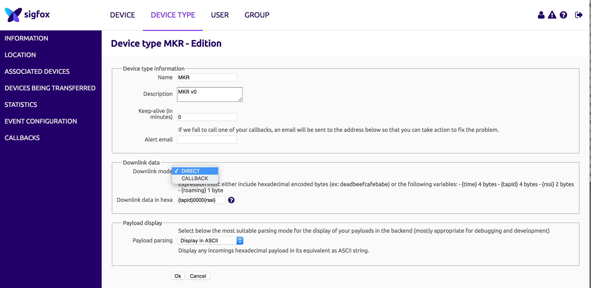
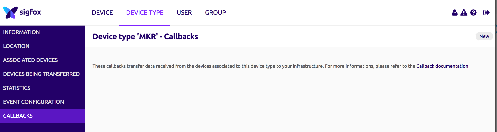
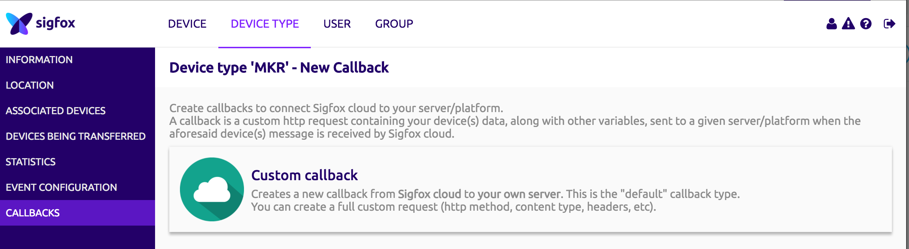
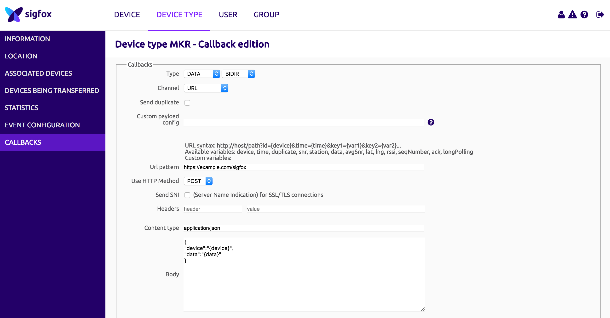
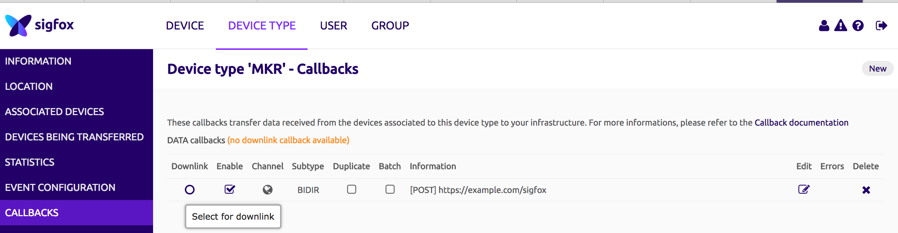
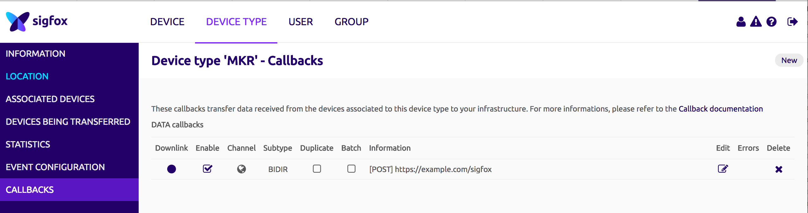

# Sigfox Downlink Callback

## About Sigfox

Sigfox operates a global network, dedicated to the IoT.  
Very low energy consumption, allowing devices to last years on battery.

The network is all about small messages (12 bytes of useful payload) every now and then (up to 140 times per day).

As the network is bi-directionnal, you can send data from your server to your devices whenever they ask for an update

Check out our [developers portal](http://makers.sigfox.com) to get more informations about Sigfox.

## Downlink details

A _downlink_ message is a message sent _to_ your device.  
Using the Sigfox network, this message can be sent either by the network itself (direct, with a few built-in vars), or by the user's application server (callback)

Each downlink message is an 8-bytes frame.

Every time one of your devices will request a downlink message, the callback URL you defined will be called.
You need to send back an `HTTP 200 OK` response, and the **8 bytes** response.
In some cases, you may have no data to send, then simply reply with a `HTTP 204 No Content`. This way, no message will be sent to your device.

When sending back some data, you must comply with the following:

 Header : `Content-Type: application/json`

 Response body:

	{
	  '{{deviceId}}': {
    	'downlinkData':{{data}}
 	 }
	}
	
## Set up your downlink callback

1. Log in your [Sigfox Cloud](http://backend.sigfox.com) account.
2. Navigate to the appropriate _device type_ menu
3. Edit the device type, to set the _Downlink mode_ to _callback_

4. In the _Callbacks_ menu, create a _custom callback_

5. Set the following settings 
  * Type: DATA / BIDIR
  * Channel: URL
  * Url pattern : Your domain + endpoint
  * Check the POST checkbox
  * Content type : _application/json_
  * Body : the data that will be sent to your service. Customize to your needs
 
In this example, the body was set as: 

	
	{
		"deviceId":"{device}",
		"data": "{data}"
	}

5. Activate your downlink callback

By default the `BIDIR`callback will be inactive after creation

Click the _Downlink_ picto to activate it.  
Bear in mind that only one downlink callback can be active at a time.

## Examples

This repository contains boilerplate examples in different languages. The goal is to help you getting started with your favorite language.  
Fixes, pull requests, ... are all welcome :)

### Available Code Samples
#### NodeJS

* [Basic server](./nodejs/), using hapi

#### Php
* [Vanilla Php](./php/vanilla/)
* [Basic Silex app](./php/silex) (+Composer)
